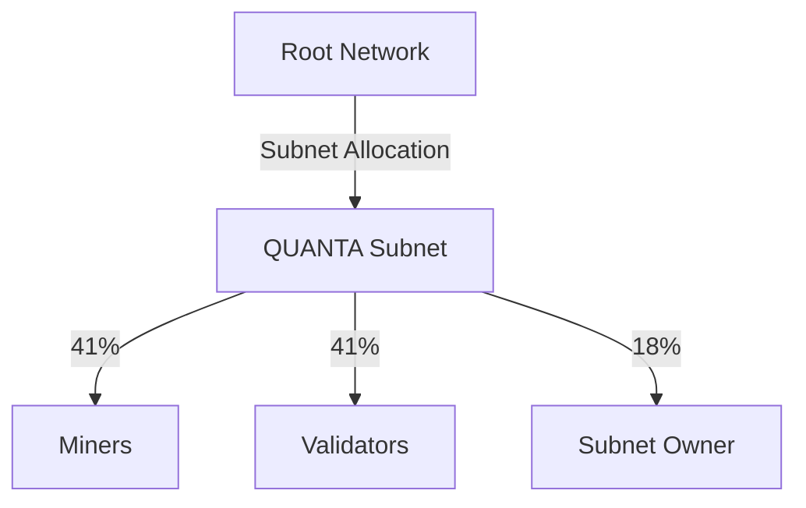

# Bittensor Integration

QUANTA operates as a subnet within the [Bittensor](https://bittensor.com) network, inheriting its decentralized infrastructure, economic model, and consensus mechanisms.

## What is Bittensor?

Bittensor is a decentralized network for AI and machine learning. Think of it as:

- **Bitcoin for AI** — Incentivized computation network
- **Subnet Architecture** — Specialized networks for different tasks
- **TAO Token** — Native currency for rewards and staking

<Info>
Bittensor has 64+ active subnets covering everything from text generation to financial prediction.
</Info>

## Subnet Architecture

### How Subnets Work

Each subnet in Bittensor is a specialized network with:

```
Root Network (TAO Distribution)
        ↓
    Subnet 1    Subnet 2    ...    QUANTA (SN-X)
        ↓           ↓                   ↓
    Miners      Miners              Signal Generators
        ↓           ↓                   ↓
    Validators  Validators          Validators
```

### QUANTA's Position

QUANTA competes with other subnets for TAO emissions based on:

1. **Network Value** — Quality of signals produced
2. **Validator Stake** — Amount of TAO staked by validators
3. **Activity Metrics** — Transaction volume, unique participants

## UID System

### What is a UID?

A UID (Unique Identifier) is a slot in the subnet that allows participation:

| Property | Value |
|----------|-------|
| Maximum UIDs | 256 per subnet |
| Registration | Requires TAO deposit |
| Competition | Top performers retain UIDs |
| Deregistration | Poor performers lose UIDs |

### QUANTA's Solution

Traditional subnets are limited to 256 participants. QUANTA's Signal Pool overcomes this:

```
Traditional:     1 UID = 1 Participant = 1 Signal
QUANTA:          Signal Pool = Unlimited Participants
                        ↓
                 256 UIDs aggregate and present signals
```

## TAO Economics

### Emission Flow

TAO flows from Bittensor's root network to subnets, then to participants:



### Emission Split

| Recipient | Share | Purpose |
|-----------|-------|---------|
| Miners | 41% | Reward signal quality |
| Validators | 41% | Reward infrastructure |
| Subnet Owner | 18% | Protocol development |

<Note>
The 18%/41%/41% split is standard across Bittensor subnets and aligns with dTAO mechanics.
</Note>

### dTAO Mechanism

dTAO (dynamic TAO) adjusts emissions based on subnet performance:

```python
subnet_emissions = base_emissions × subnet_weight

Where subnet_weight depends on:
- Validator stake in subnet
- Root network voting
- Historical performance
```

## Yuma Consensus

### What is Yuma?

Yuma is Bittensor's consensus mechanism for agreeing on performance scores.

<Steps>
  <Step title="Score Submission">
    Each validator submits scores for all miners/signals
  </Step>
  <Step title="Stake Weighting">
    Scores are weighted by validator stake
  </Step>
  <Step title="Consensus Calculation">
    Final score = stake-weighted median
  </Step>
  <Step title="Reward Distribution">
    Rewards distributed based on consensus scores
  </Step>
</Steps>

### Consensus Parameters

| Parameter | Value | Meaning |
|-----------|-------|---------|
| κ (kappa) | 0.67 | Minimum agreement threshold |
| Tempo | 360 blocks | Consensus frequency |
| Weight Update | Every epoch | Score refresh rate |

### Consensus Example

```python
# Three validators with different stakes
validator_scores = {
    "V1": {"signal_A": 80, "stake": 1000},
    "V2": {"signal_A": 85, "stake": 2000},
    "V3": {"signal_A": 75, "stake": 1000},
}

# Stake-weighted average
total_stake = 4000
consensus_score = (80×1000 + 85×2000 + 75×1000) / 4000 = 81.25
```

## Wallet Management

### Key Types

Bittensor uses two key types:

<Tabs>
  <Tab title="Coldkey">
    **Purpose:** Long-term storage, high security

    - Controls stake and registration
    - Should be kept offline
    - Used for major operations

    ```bash
    btcli wallet create --wallet.name mywallet
    ```
  </Tab>
  <Tab title="Hotkey">
    **Purpose:** Daily operations, node identity

    - Signs transactions
    - Identifies your node
    - Can be on live servers

    ```bash
    btcli wallet new_hotkey --wallet.name mywallet
    ```
  </Tab>
</Tabs>

### Security Best Practices

<CardGroup cols={2}>
  <Card title="Coldkey Offline" icon="lock">
    Keep coldkey on an airgapped machine
  </Card>
  <Card title="Hotkey Rotation" icon="rotate">
    Rotate hotkeys periodically
  </Card>
  <Card title="Backup Seeds" icon="key">
    Store seed phrases securely offline
  </Card>
  <Card title="Hardware Wallet" icon="microchip">
    Use hardware wallet for coldkey
  </Card>
</CardGroup>

## Registration

### Miner Registration

```bash
# Register as miner on QUANTA subnet
btcli subnet register \
    --netuid X \
    --wallet.name mywallet \
    --wallet.hotkey default

# Check registration
btcli subnet metagraph --netuid X
```

### Validator Registration

```bash
# Register as validator
btcli subnet register \
    --netuid X \
    --wallet.name validator_wallet \
    --wallet.hotkey validator_hotkey

# Stake TAO to validator
btcli stake add \
    --wallet.name validator_wallet \
    --amount 1000
```

### Registration Costs

| Action | Cost | Notes |
|--------|------|-------|
| Subnet Registration | 1 TAO (recycle) | Refunded on deregistration |
| Validator Stake | 1,000+ TAO | Required for consensus weight |
| α-Token Stake | 10,000+ α | Required for validation |

## Cross-Subnet Opportunities

### Future Integrations

QUANTA can interact with other Bittensor subnets:

<AccordionGroup>
  <Accordion title="Data Subnets" icon="database">
    Source alternative data from scraping/sentiment subnets for enhanced signals
  </Accordion>
  <Accordion title="Compute Subnets" icon="server">
    Offload backtesting and simulation to compute subnets
  </Accordion>
  <Accordion title="Oracle Subnets" icon="tower-broadcast">
    Cross-validate market data with decentralized oracle networks
  </Accordion>
</AccordionGroup>

## Bittensor Resources

<CardGroup cols={2}>
  <Card title="Bittensor Docs" icon="book" href="https://docs.bittensor.com">
    Official Bittensor documentation
  </Card>
  <Card title="Taostats" icon="chart-bar" href="https://taostats.io">
    Network analytics and stats
  </Card>
  <Card title="Discord" icon="discord" href="https://discord.gg/bittensor">
    Bittensor community
  </Card>
  <Card title="GitHub" icon="github" href="https://github.com/opentensor">
    Open-source repositories
  </Card>
</CardGroup>

## Next Steps

<CardGroup cols={2}>
  <Card title="Quickstart" icon="rocket" href="/guides/quickstart">
    Get started with QUANTA
  </Card>
  <Card title="Tokenomics" icon="coins" href="/tokenomics/overview">
    Understand QUANTA's economic model
  </Card>
</CardGroup>
