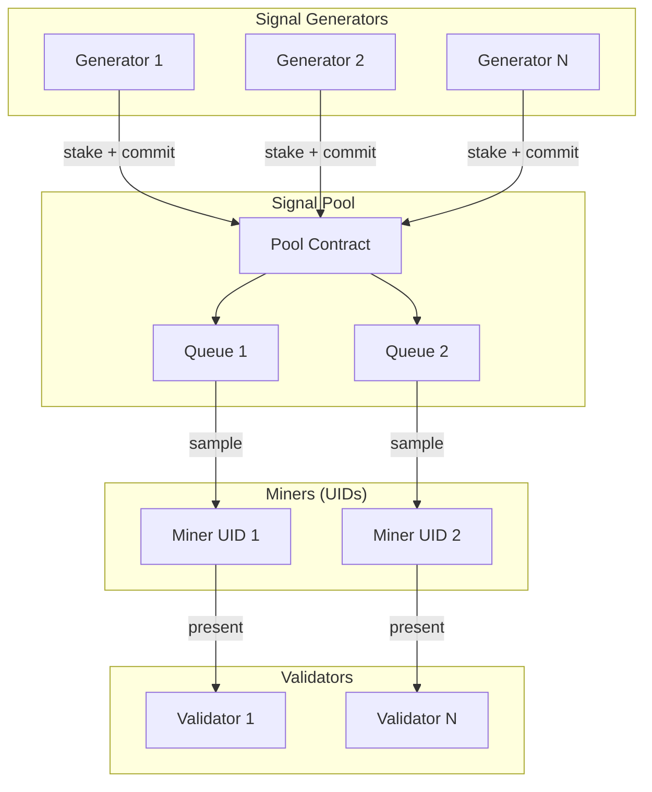

# Signal Pool

The Signal Pool is QUANTA's core architectural innovation. It decouples signal submission from miner identity, enabling unlimited participation in the network.

## The Problem

Bittensor subnets have a hard limit of **256 UIDs** (unique identifiers). This creates several issues:

<CardGroup cols={2}>
  <Card title="Limited Competition" icon="users-slash">
    Only 256 participants can compete at any time
  </Card>
  <Card title="Winner Takes All" icon="trophy">
    Top performers capture all emissions, pushing out newcomers
  </Card>
  <Card title="No Diversity" icon="copy">
    Limited signals means limited portfolio diversity
  </Card>
  <Card title="High Barriers" icon="door-closed">
    Registration costs increase as slots fill up
  </Card>
</CardGroup>

## The Solution

The Signal Pool separates **signal submission** from **miner registration**:

```
Traditional Bittensor:
  1 Miner → 1 UID → 1 Signal

QUANTA Signal Pool:
  N Signal Generators → Signal Pool → M Miners (UIDs) → Validators
```

### How It Works

<Steps>
  <Step title="Signal Submission">
    Anyone can submit portfolio signals to the Signal Pool by staking α-tokens. No UID required.
  </Step>
  <Step title="Pool Aggregation">
    Signals are cryptographically committed and stored in the pool with attribution metadata.
  </Step>
  <Step title="Miner Sampling">
    Registered miners (UID holders) sample signals from the pool to present to validators.
  </Step>
  <Step title="Validator Evaluation">
    Validators evaluate all signals and assign scores based on performance.
  </Step>
  <Step title="Reward Attribution">
    Rewards flow back to original signal generators through the attribution system.
  </Step>
</Steps>

## Pool Architecture



## Key Properties

### Unlimited Participation

| Metric | Traditional | Signal Pool |
|--------|-------------|-------------|
| Max Participants | 256 | Unlimited |
| Signals Per Entity | 1 | Multiple |
| Entry Barrier | UID Registration | α-Token Stake |

### Cryptographic Attribution

Every signal in the pool is cryptographically signed and timestamped:

```python
signal_commitment = {
    "portfolio_hash": sha256(portfolio_weights),
    "generator_pubkey": public_key,
    "stake_amount": ante_tokens,
    "timestamp": block_number,
    "signature": sign(portfolio_hash, private_key)
}
```

<Info>
Attribution ensures rewards always flow to the original signal creator, even when presented by a different miner.
</Info>

### Proportional Staking

Stake requirements scale with position size:

```
Required Stake = Base_Stake × Position_Size_Factor × Conviction_Multiplier

Example:
- 10% position in AAPL → 10 α stake
- 20% position in AAPL → 20 α stake
- Higher conviction = more skin in the game
```

## Pool Operators

**Pool Operators** are a special category of participants who:

1. Hold one or more UIDs
2. Aggregate signals from multiple generators
3. Present aggregated portfolios to validators
4. Distribute rewards back to generators (minus operator fee)

### Operator Economics

| Role | Earnings | Costs |
|------|----------|-------|
| Pool Operator | 15% of generator rewards | UID registration + infrastructure |
| Signal Generator | 85% of signal rewards | Proportional α-token stake |

<Note>
Pool Operators enable small generators to participate without the cost of UID registration, similar to how mining pools work in Bitcoin.
</Note>

## Anti-Gaming Protections

The Signal Pool includes several mechanisms to prevent manipulation:

### 1. Commit-Reveal Scheme

Signals are submitted in two phases:

```
Phase 1 (Commit): Submit hash of portfolio
Phase 2 (Reveal): Reveal actual portfolio weights

If revealed portfolio doesn't match committed hash → signal rejected
```

This prevents front-running and signal copying.

### 2. Minimum Stake Duration

Stakes cannot be withdrawn for a minimum period:

- **New signals:** 7-day lock
- **Updated signals:** 24-hour lock

### 3. Correlation Penalties

Signals highly correlated with existing pool signals receive reduced rewards:

```
Effective_Reward = Base_Reward × (1 - Correlation_Penalty)

Where:
- Correlation > 0.8 with existing signal → 50% penalty
- Correlation > 0.9 with existing signal → 80% penalty
```

<Warning>
Copying other generators' signals will result in significantly reduced rewards.
</Warning>

## Pool Capacity

The Signal Pool is designed to scale:

| Parameter | Value | Notes |
|-----------|-------|-------|
| Max Signals | 10,000+ | Limited by validator compute |
| Min Stake | 1 α | Spam prevention |
| Signal TTL | 90 days | Auto-expiry if not renewed |
| Update Frequency | Hourly | During market hours |

## Example Flow

Let's walk through a complete signal lifecycle:

<Tabs>
  <Tab title="1. Submission">
    Alice wants to submit a momentum strategy:
    ```python
    portfolio = {
        "NVDA": 0.15,  # 15% long
        "AMD": 0.10,   # 10% long
        "INTC": -0.05, # 5% short
        # ... more positions
    }

    # Stake proportional to position size
    total_exposure = sum(abs(w) for w in portfolio.values())
    required_stake = total_exposure * BASE_STAKE_RATE

    # Submit to pool
    signal_pool.commit(hash(portfolio), required_stake)
    ```
  </Tab>
  <Tab title="2. Reveal">
    After commit window closes:
    ```python
    # Reveal actual portfolio
    signal_pool.reveal(portfolio, signature)

    # Validation
    assert hash(portfolio) == committed_hash
    assert verify_signature(portfolio, signature, alice_pubkey)
    ```
  </Tab>
  <Tab title="3. Evaluation">
    Validators fetch and evaluate:
    ```python
    # Validators sample signals
    signals = signal_pool.sample(batch_size=100)

    for signal in signals:
        # Simulate portfolio performance
        returns = simulate(signal.portfolio, price_data)

        # Calculate metrics
        score = calculate_composite_score(
            sortino=sortino_ratio(returns),
            calmar=calmar_ratio(returns),
            max_dd=max_drawdown(returns),
            turnover=calculate_turnover(signal)
        )

        scores[signal.id] = score
    ```
  </Tab>
  <Tab title="4. Rewards">
    After consensus:
    ```python
    # Rewards distributed based on scores
    alice_reward = (
        alice_score / total_scores
    ) * epoch_emissions

    # Plus ante redistribution if top performer
    if alice_rank <= TOP_TIER:
        alice_reward += share_of_loser_pot
    ```
  </Tab>
</Tabs>

## Next Steps

<CardGroup cols={2}>
  <Card title="Miners" icon="hammer" href="/concepts/miners">
    Learn about miner roles and operations
  </Card>
  <Card title="Validators" icon="shield-check" href="/concepts/validators">
    Understand validator responsibilities
  </Card>
</CardGroup>
