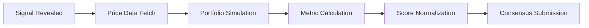

# Evaluation Process

Every signal in QUANTA is rigorously evaluated by validators using real market data. This page explains the complete evaluation pipeline.

## Evaluation Overview



## Data Sources

### Price Data

Validators fetch OHLCV (Open, High, Low, Close, Volume) data from approved sources:

| Source | Priority | Use Case |
|--------|----------|----------|
| Polygon.io | Primary | Real-time and historical |
| Alpha Vantage | Secondary | Cross-validation |
| Yahoo Finance | Tertiary | Backup/fallback |

### Data Requirements

```python
# Required fields per ticker
price_data = {
    "AAPL": {
        "open": [150.00, 151.20, ...],
        "high": [152.50, 153.00, ...],
        "low": [149.50, 150.80, ...],
        "close": [151.80, 152.30, ...],
        "volume": [45000000, 48000000, ...],
        "adj_close": [151.80, 152.30, ...],  # Dividend/split adjusted
    }
}
```

<Warning>
All validators must use the same data source for the primary evaluation to ensure consensus. Cross-validation uses secondary sources.
</Warning>

## Portfolio Simulation

### Return Calculation

Daily returns are calculated using adjusted close prices:

```python
def calculate_portfolio_returns(portfolio, price_data, days):
    daily_returns = []

    for day in range(days):
        portfolio_return = 0

        for ticker, weight in portfolio.items():
            # Stock return for the day
            stock_return = (
                price_data[ticker]["adj_close"][day + 1] /
                price_data[ticker]["adj_close"][day]
            ) - 1

            # Contribution to portfolio
            portfolio_return += weight * stock_return

        daily_returns.append(portfolio_return)

    return daily_returns
```

### Transaction Cost Model

Validators apply realistic transaction costs:

```python
def apply_transaction_costs(returns, turnover_events):
    costs_per_trade = {
        "spread": 0.0005,      # 5 basis points
        "commission": 0.00005, # 0.5 basis points
        "market_impact": lambda size: 0.0002 * sqrt(size / ADV)
    }

    for event in turnover_events:
        trade_cost = (
            costs_per_trade["spread"] +
            costs_per_trade["commission"] +
            costs_per_trade["market_impact"](event.size)
        )
        returns[event.day] -= trade_cost * event.turnover

    return returns
```

### Corporate Actions

Validators adjust for corporate actions:

| Action | Adjustment |
|--------|------------|
| Dividends | Reinvested at close |
| Stock splits | Position size adjusted |
| Spin-offs | New ticker added |
| Delistings | Position closed at last price |

## Multi-Horizon Evaluation

### Rolling Windows

Each signal is evaluated over three overlapping windows:

<Tabs>
  <Tab title="7-Day Window">
    **Weight:** 20%

    ```python
    short_metrics = evaluate_window(
        returns=returns[-7:],
        window_name="7-day"
    )
    ```

    Captures recent performance and quick alpha decay.
  </Tab>
  <Tab title="30-Day Window">
    **Weight:** 30%

    ```python
    medium_metrics = evaluate_window(
        returns=returns[-30:],
        window_name="30-day"
    )
    ```

    Balances responsiveness with noise reduction.
  </Tab>
  <Tab title="90-Day Window">
    **Weight:** 50%

    ```python
    long_metrics = evaluate_window(
        returns=returns[-90:],
        window_name="90-day"
    )
    ```

    Rewards long-term consistency and strategy robustness.
  </Tab>
</Tabs>

### Window Aggregation

```python
def aggregate_windows(short, medium, long):
    return {
        "sortino": 0.20 * short["sortino"] + 0.30 * medium["sortino"] + 0.50 * long["sortino"],
        "calmar": 0.20 * short["calmar"] + 0.30 * medium["calmar"] + 0.50 * long["calmar"],
        "max_dd": 0.20 * short["max_dd"] + 0.30 * medium["max_dd"] + 0.50 * long["max_dd"],
        "turnover": 0.20 * short["turnover"] + 0.30 * medium["turnover"] + 0.50 * long["turnover"],
    }
```

## Metric Calculations

### Sortino Ratio

```python
def sortino_ratio(returns, risk_free_rate=0.05):
    # Annualize risk-free rate to daily
    daily_rf = (1 + risk_free_rate) ** (1/252) - 1

    # Excess returns
    excess_returns = [r - daily_rf for r in returns]

    # Downside returns only
    downside_returns = [r for r in excess_returns if r < 0]

    # Downside deviation
    downside_dev = sqrt(sum(r**2 for r in downside_returns) / len(returns))

    # Annualized Sortino
    mean_excess = sum(excess_returns) / len(returns)
    sortino = (mean_excess * 252) / (downside_dev * sqrt(252))

    return sortino
```

### Calmar Ratio

```python
def calmar_ratio(returns):
    # Cumulative returns
    cumulative = [1.0]
    for r in returns:
        cumulative.append(cumulative[-1] * (1 + r))

    # Annualized return
    total_return = cumulative[-1] / cumulative[0] - 1
    days = len(returns)
    annual_return = (1 + total_return) ** (252 / days) - 1

    # Maximum drawdown
    max_dd = max_drawdown(cumulative)

    return annual_return / max_dd if max_dd > 0 else float('inf')
```

### Maximum Drawdown

```python
def max_drawdown(cumulative_values):
    peak = cumulative_values[0]
    max_dd = 0

    for value in cumulative_values:
        if value > peak:
            peak = value
        drawdown = (peak - value) / peak
        max_dd = max(max_dd, drawdown)

    return max_dd
```

### Turnover Calculation

```python
def calculate_turnover(portfolio_history):
    total_turnover = 0

    for i in range(1, len(portfolio_history)):
        prev = portfolio_history[i-1]
        curr = portfolio_history[i]

        # Sum of absolute weight changes
        turnover = sum(
            abs(curr.get(t, 0) - prev.get(t, 0))
            for t in set(prev.keys()) | set(curr.keys())
        ) / 2  # Divide by 2 (buying = selling)

        total_turnover += turnover

    # Average monthly turnover
    months = len(portfolio_history) / 21  # ~21 trading days/month
    return total_turnover / months if months > 0 else 0
```

## Score Normalization

### Cross-Sectional Ranking

Each metric is normalized across all signals:

```python
def normalize_scores(raw_scores, metric_type):
    # Winsorize outliers
    p1, p99 = percentile(raw_scores, [1, 99])
    clipped = [max(p1, min(p99, s)) for s in raw_scores]

    # Min-max normalization
    min_score = min(clipped)
    max_score = max(clipped)

    if metric_type in ["sortino", "calmar"]:
        # Higher is better
        normalized = [(s - min_score) / (max_score - min_score) for s in clipped]
    else:
        # Lower is better (max_dd, turnover)
        normalized = [(max_score - s) / (max_score - min_score) for s in clipped]

    return normalized
```

### Composite Score

```python
def composite_score(metrics):
    return (
        0.35 * metrics["sortino_normalized"] +
        0.25 * metrics["calmar_normalized"] +
        0.25 * metrics["max_dd_normalized"] +
        0.15 * metrics["turnover_normalized"]
    )
```

## Consensus Process

### Validator Score Submission

Each validator submits scores independently:

```python
# Validator submission
for signal_id, score in computed_scores.items():
    consensus.submit_score(
        signal_id=signal_id,
        score=score,
        validator_signature=sign(score, validator_key),
        data_hash=hash(price_data_used)
    )
```

### Score Aggregation

Yuma consensus aggregates scores:

```python
def yuma_consensus(validator_scores, stakes):
    """
    Stake-weighted median with κ=0.67 threshold
    """
    # Sort by score
    sorted_scores = sorted(
        validator_scores.items(),
        key=lambda x: x[1]["score"]
    )

    # Find stake-weighted median
    cumulative_stake = 0
    total_stake = sum(stakes.values())
    threshold = total_stake * 0.67

    for validator_id, data in sorted_scores:
        cumulative_stake += stakes[validator_id]
        if cumulative_stake >= threshold:
            return data["score"]

    return sorted_scores[-1][1]["score"]
```

### Consensus Verification

Validators outside consensus face penalties:

```python
def check_consensus_alignment(my_score, consensus_score):
    deviation = abs(my_score - consensus_score) / consensus_score

    if deviation > 0.10:  # >10% deviation
        return "SLASHING_RISK"
    elif deviation > 0.05:  # >5% deviation
        return "WARNING"
    else:
        return "ALIGNED"
```

## Evaluation Timeline

```
Day N: Signal Submission
├── 0:00 - Commit window opens
├── 0:50 - Commit window closes
├── 0:50 - Reveal window opens
└── 1:00 - Reveal window closes, evaluation begins

Day N+1 to N+7: 7-Day Evaluation Builds
Day N+1 to N+30: 30-Day Evaluation Builds
Day N+1 to N+90: 90-Day Evaluation Builds

Continuous: Rolling window updates every epoch
```

## Special Cases

### New Signals

Signals with < 7 days of history:

| History | Treatment |
|---------|-----------|
| < 7 days | Preliminary score only, no rewards |
| 7-29 days | 7-day score only (reduced weight) |
| 30-89 days | 7-day + 30-day scores |
| 90+ days | Full scoring |

### Missing Data

When price data is unavailable:

```python
def handle_missing_data(ticker, date):
    # Try backup sources
    for source in BACKUP_SOURCES:
        data = fetch_from(source, ticker, date)
        if data:
            return data

    # If still missing, use last known price
    return last_known_price(ticker)
```

<Note>
Signals with >10% exposure to tickers with missing data receive a data quality penalty.
</Note>

## Next Steps

<CardGroup cols={2}>
  <Card title="Rewards Distribution" icon="coins" href="/how-it-works/rewards">
    How scores become rewards
  </Card>
  <Card title="Scoring Deep Dive" icon="calculator" href="/concepts/scoring">
    Mathematical details of metrics
  </Card>
</CardGroup>
