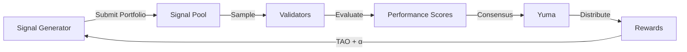

# How QUANTA Works

QUANTA operates as a continuous competition where signal generators submit portfolio recommendations, validators evaluate performance, and rewards flow to the best performers.

## The Simple Version

<Steps>
  <Step title="Submit Signals">
    Signal generators submit portfolio weights for U.S. stocks (e.g., "10% AAPL long, 5% TSLA short...")
  </Step>
  <Step title="Track Performance">
    Validators simulate each portfolio using real market data over 7, 30, and 90 days
  </Step>
  <Step title="Score Results">
    Portfolios are ranked by risk-adjusted metrics (Sortino, Calmar, drawdown)
  </Step>
  <Step title="Distribute Rewards">
    Top performers earn TAO emissions + redistributed stakes from underperformers
  </Step>
</Steps>

## The Flow



## Key Components

### Signal Pool

The Signal Pool is QUANTA's breakthrough innovation. It solves Bittensor's 256 UID limitation by separating signal submission from miner identity.

<Info>
**Why this matters:** Without the Signal Pool, only 256 participants could compete. With it, unlimited signal generators can submit portfolios.
</Info>

| Without Signal Pool | With Signal Pool |
|---------------------|------------------|
| 256 max participants | Unlimited participants |
| 1 signal per UID | Multiple signals per generator |
| Winner takes all | Diverse portfolio aggregation |

### Evaluation Windows

QUANTA uses three rolling windows to balance responsiveness with consistency:

| Window | Duration | Weight | Purpose |
|--------|----------|--------|---------|
| Short | 7 days | 20% | Capture recent alpha |
| Medium | 30 days | 30% | Reduce noise |
| Long | 90 days | 50% | Reward consistency |

<Warning>
Signals are evaluated continuously. A strong 7-day performance won't save a strategy with poor 90-day results.
</Warning>

### Scoring Metrics

Your composite score combines six risk-adjusted metrics:

<AccordionGroup>
  <Accordion title="Sharpe Ratio (40% weight)" icon="chart-line">
    The **primary metric** — industry-standard risk-adjusted returns.

    ```
    Sharpe = (Return - Risk-Free Rate) / Volatility
    ```

    **Target:** 1.0+ is good, 2.0+ is excellent
  </Accordion>

  <Accordion title="Total P/L % (20% weight)" icon="dollar-sign">
    Absolute return performance. Raw profit and loss matters.

    ```
    P/L = (Final Value - Initial Value) / Initial Value
    ```

    **Target:** Positive returns
  </Accordion>

  <Accordion title="Maximum Drawdown (15% weight)" icon="arrow-trend-down">
    The largest peak-to-trough decline. Critical for capital preservation.

    **Target:** Below 10% is excellent
  </Accordion>

  <Accordion title="Sortino Ratio (10% weight)" icon="shield">
    Refines Sharpe by only penalizing **downside** volatility.

    ```
    Sortino = (Return - Risk-Free Rate) / Downside Deviation
    ```

    **Target:** 2.0+ is excellent
  </Accordion>

  <Accordion title="Calmar Ratio (10% weight)" icon="chart-bar">
    Measures return relative to maximum drawdown.

    ```
    Calmar = Annual Return / Max Drawdown
    ```

    **Target:** 1.5+ is excellent
  </Accordion>

  <Accordion title="Turnover Penalty (5% weight)" icon="rotate">
    Penalizes excessive trading. High turnover = high transaction costs.

    **Target:** Below 20% monthly turnover
  </Accordion>
</AccordionGroup>

## Reward Distribution

QUANTA uses a dual revenue model:

### 1. TAO Emissions (Bittensor Native)

The network receives TAO from Bittensor's emission schedule:

| Recipient | Share | Purpose |
|-----------|-------|---------|
| Miners | 41% | Performance-weighted rewards |
| Validators | 41% | Consensus participation |
| Subnet Owner | 18% | Protocol development |

### 2. Competition Pot (Ante Redistribution)

Signal generators stake α-tokens proportional to their position sizes:

```
All generators stake proportional ante
        ↓
Network rake (8%) taken FIRST
        ↓
Performance evaluation
        ↓
Bottom 20-30% forfeit ante → 50% burned, 50% to winners
Break-even tier (25%) → ante returned
Profitable tier (35%) → ante + share of winner pool
Top tier (10%) → ante + premium share
```

<Tip>
The dual model ensures sustainability: emissions keep infrastructure running, while the ante pool rewards genuine alpha generation.
</Tip>

## Epoch Lifecycle

Each epoch follows a predictable cycle:

<Tabs>
  <Tab title="1-Hour Epochs">
    - Signal submission window opens
    - Generators submit/update portfolios
    - Window closes, validators begin evaluation
    - Scores calculated and weights updated
  </Tab>
  <Tab title="Daily Settlements">
    - Rolling window performance updated
    - Composite scores recalculated
    - Reward distribution executed
    - Leaderboards updated
  </Tab>
</Tabs>

## Anti-Gaming Mechanisms

QUANTA includes several protections against manipulation:

<CardGroup cols={2}>
  <Card title="Commit-Reveal" icon="lock">
    Signals are cryptographically committed before reveal, preventing front-running
  </Card>
  <Card title="Minimum Track Record" icon="clock">
    New signals must pass a 7-day evaluation period before earning full rewards
  </Card>
  <Card title="Correlation Penalty" icon="link-slash">
    Highly correlated signals are penalized to encourage diversity
  </Card>
  <Card title="Stake Requirements" icon="coins">
    Proportional staking prevents spam submissions
  </Card>
</CardGroup>

## Next Steps

<CardGroup cols={2}>
  <Card title="Signal Pool Deep Dive" icon="database" href="/concepts/signal-pool">
    Learn how the Signal Pool enables unlimited participation
  </Card>
  <Card title="Quickstart Guide" icon="rocket" href="/guides/quickstart">
    Start submitting signals in 10 minutes
  </Card>
</CardGroup>
