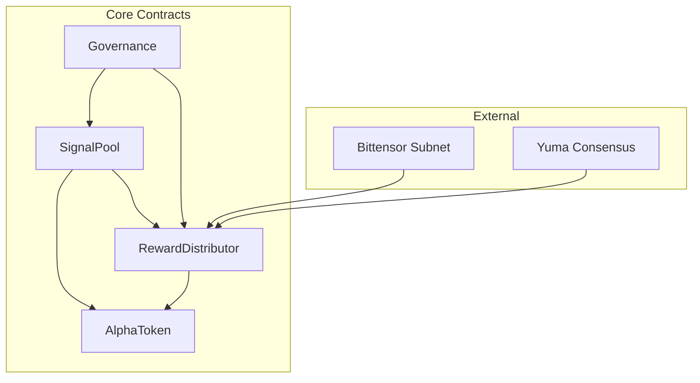

# Smart Contracts

QUANTA uses smart contracts for signal management, staking, and reward distribution. This document covers the contract architecture and interfaces.

## Architecture Overview



## Contract Addresses

| Contract | Mainnet | Testnet |
|----------|---------|---------|
| SignalPool | `TBD` | `TBD` |
| RewardDistributor | `TBD` | `TBD` |
| AlphaToken | `TBD` | `TBD` |
| Governance | `TBD` | `TBD` |

<Warning>
Contracts are not yet deployed. These interfaces are subject to change before mainnet launch.
</Warning>

## SignalPool Contract

The SignalPool contract manages signal submissions, stakes, and the commit-reveal process.

### Interface

```solidity
// SPDX-License-Identifier: MIT
pragma solidity ^0.8.19;

interface ISignalPool {
    // Events
    event SignalCommitted(
        bytes32 indexed commitmentId,
        address indexed submitter,
        uint256 stakeAmount,
        uint256 deadline
    );

    event SignalRevealed(
        bytes32 indexed signalId,
        bytes32 indexed commitmentId,
        address indexed submitter
    );

    event SignalUpdated(
        bytes32 indexed signalId,
        bytes32 newPortfolioHash
    );

    event SignalWithdrawn(
        bytes32 indexed signalId,
        address indexed submitter,
        uint256 stakeReturned
    );

    // Commit phase
    function commit(
        bytes32 commitment,
        uint256 stakeAmount,
        string calldata strategyTag
    ) external returns (bytes32 commitmentId);

    // Reveal phase
    function reveal(
        bytes32 commitmentId,
        bytes calldata portfolio,
        bytes32 nonce
    ) external returns (bytes32 signalId);

    // Update existing signal
    function updateSignal(
        bytes32 signalId,
        bytes calldata newPortfolio,
        bytes32 newNonce
    ) external;

    // Withdraw signal and stake
    function withdrawSignal(bytes32 signalId) external;

    // Emergency withdraw (with penalty)
    function emergencyWithdraw(bytes32 signalId) external;

    // View functions
    function getSignal(bytes32 signalId) external view returns (Signal memory);
    function getCommitment(bytes32 commitmentId) external view returns (Commitment memory);
    function getStakeRequirement(uint256 grossExposure) external view returns (uint256);
    function isCommitWindowOpen() external view returns (bool);
    function isRevealWindowOpen() external view returns (bool);
}

struct Signal {
    bytes32 id;
    address submitter;
    bytes32 portfolioHash;
    uint256 stake;
    string strategyTag;
    uint256 createdAt;
    uint256 updatedAt;
    SignalStatus status;
}

struct Commitment {
    bytes32 id;
    address submitter;
    bytes32 hash;
    uint256 stake;
    uint256 deadline;
    bool revealed;
}

enum SignalStatus {
    Active,
    Pending,
    Withdrawn,
    Liquidated
}
```

### Usage Example

```javascript
const { ethers } = require('ethers');

// Connect to contract
const signalPool = new ethers.Contract(
    SIGNAL_POOL_ADDRESS,
    SIGNAL_POOL_ABI,
    signer
);

// Commit a signal
const portfolio = { AAPL: 0.10, MSFT: 0.08 };
const portfolioBytes = ethers.utils.toUtf8Bytes(JSON.stringify(portfolio));
const nonce = ethers.utils.randomBytes(32);
const commitment = ethers.utils.keccak256(
    ethers.utils.concat([portfolioBytes, nonce])
);

const tx = await signalPool.commit(
    commitment,
    ethers.utils.parseEther("15"),  // 15 α stake
    "momentum_v1"
);
const receipt = await tx.wait();
const commitmentId = receipt.events[0].args.commitmentId;

// Reveal (after commit window closes)
const revealTx = await signalPool.reveal(
    commitmentId,
    portfolioBytes,
    nonce
);
```

---

## AlphaToken Contract

ERC-20 compatible token with staking functionality.

### Interface

```solidity
// SPDX-License-Identifier: MIT
pragma solidity ^0.8.19;

import "@openzeppelin/contracts/token/ERC20/IERC20.sol";

interface IAlphaToken is IERC20 {
    // Staking
    function stake(uint256 amount) external;
    function unstake(uint256 amount) external;
    function stakedBalanceOf(address account) external view returns (uint256);

    // Burning
    function burn(uint256 amount) external;
    function burnFrom(address account, uint256 amount) external;

    // Minting (only RewardDistributor)
    function mint(address to, uint256 amount) external;

    // View
    function totalStaked() external view returns (uint256);
}
```

### Token Parameters

| Parameter | Value |
|-----------|-------|
| Name | QUANTA Alpha Token |
| Symbol | ALPHA |
| Decimals | 18 |
| Total Supply | 100,000,000 |
| Max Supply | 100,000,000 (fixed) |

---

## RewardDistributor Contract

Handles TAO and α-token reward distribution.

### Interface

```solidity
// SPDX-License-Identifier: MIT
pragma solidity ^0.8.19;

interface IRewardDistributor {
    // Events
    event RewardsDistributed(
        uint256 indexed epoch,
        uint256 totalTao,
        uint256 totalAlpha
    );

    event RewardsClaimed(
        address indexed recipient,
        uint256 taoAmount,
        uint256 alphaAmount
    );

    event AntesProcessed(
        uint256 indexed epoch,
        uint256 totalForfeited,
        uint256 burned,
        uint256 redistributed
    );

    // Distribution (called by validators after consensus)
    function distributeEpochRewards(
        uint256 epoch,
        bytes32[] calldata signalIds,
        uint256[] calldata scores
    ) external;

    // Claiming
    function claimRewards(bytes32[] calldata signalIds) external;
    function claimAllRewards() external;

    // View
    function pendingRewards(address account) external view returns (
        uint256 tao,
        uint256 alpha
    );
    function epochRewards(uint256 epoch) external view returns (EpochReward memory);
}

struct EpochReward {
    uint256 epoch;
    uint256 totalTao;
    uint256 totalAlpha;
    uint256 numSignals;
    bool distributed;
    uint256 timestamp;
}
```

### Distribution Logic

```solidity
function _calculateRewards(
    uint256 score,
    uint256 totalScore,
    uint256 epochTao,
    uint256 epochAlpha
) internal pure returns (uint256 tao, uint256 alpha) {
    // Base reward proportional to score
    uint256 weight = score * 1e18 / totalScore;

    tao = epochTao * weight / 1e18;
    alpha = epochAlpha * weight / 1e18;

    // Apply multipliers for top performers
    // (handled in parent function based on rank)
}
```

---

## Governance Contract

On-chain governance for protocol parameters.

### Interface

```solidity
// SPDX-License-Identifier: MIT
pragma solidity ^0.8.19;

interface IGovernance {
    // Proposal lifecycle
    function propose(
        address[] calldata targets,
        uint256[] calldata values,
        bytes[] calldata calldatas,
        string calldata description
    ) external returns (uint256 proposalId);

    function vote(uint256 proposalId, bool support) external;
    function execute(uint256 proposalId) external;
    function cancel(uint256 proposalId) external;

    // View
    function getProposal(uint256 proposalId) external view returns (Proposal memory);
    function hasVoted(uint256 proposalId, address account) external view returns (bool);
    function getVotes(address account) external view returns (uint256);

    // Parameters
    function votingDelay() external view returns (uint256);
    function votingPeriod() external view returns (uint256);
    function quorumVotes() external view returns (uint256);
    function proposalThreshold() external view returns (uint256);
}

struct Proposal {
    uint256 id;
    address proposer;
    uint256 startBlock;
    uint256 endBlock;
    uint256 forVotes;
    uint256 againstVotes;
    bool executed;
    bool canceled;
}
```

### Governable Parameters

| Parameter | Contract | Function |
|-----------|----------|----------|
| Scoring weights | SignalPool | `setMetricWeights()` |
| Network rake | RewardDistributor | `setNetworkRake()` |
| Min stake | SignalPool | `setMinStake()` |
| Universe | SignalPool | `updateUniverse()` |
| Emission rate | AlphaToken | `setEmissionRate()` |

---

## Security

### Audit Status

| Contract | Auditor | Status |
|----------|---------|--------|
| SignalPool | TBD | Planned |
| AlphaToken | TBD | Planned |
| RewardDistributor | TBD | Planned |
| Governance | TBD | Planned |

### Access Control

```solidity
// Role-based access
bytes32 public constant ADMIN_ROLE = keccak256("ADMIN_ROLE");
bytes32 public constant VALIDATOR_ROLE = keccak256("VALIDATOR_ROLE");
bytes32 public constant DISTRIBUTOR_ROLE = keccak256("DISTRIBUTOR_ROLE");

modifier onlyAdmin() {
    require(hasRole(ADMIN_ROLE, msg.sender), "Not admin");
    _;
}

modifier onlyValidator() {
    require(hasRole(VALIDATOR_ROLE, msg.sender), "Not validator");
    _;
}
```

### Emergency Functions

```solidity
// Emergency pause
function pause() external onlyAdmin;
function unpause() external onlyAdmin;

// Emergency withdraw (governance only)
function emergencyWithdrawAll() external onlyGovernance;
```

---

## Integration

### Python SDK

```python
from quanta.contracts import SignalPool, AlphaToken

# Initialize
signal_pool = SignalPool(network="mainnet")
alpha_token = AlphaToken(network="mainnet")

# Approve token spending
alpha_token.approve(signal_pool.address, amount)

# Submit signal
signal_pool.commit(commitment, stake_amount, tag)
```

### JavaScript SDK

```javascript
import { SignalPool, AlphaToken } from '@quanta/contracts';

const signalPool = new SignalPool({ network: 'mainnet' });
const alphaToken = new AlphaToken({ network: 'mainnet' });

await alphaToken.approve(signalPool.address, amount);
await signalPool.commit(commitment, stakeAmount, tag);
```

## Next Steps

<CardGroup cols={2}>
  <Card title="API Reference" icon="code" href="/reference/api">
    REST and WebSocket APIs
  </Card>
  <Card title="Quickstart" icon="rocket" href="/guides/quickstart">
    Start interacting with contracts
  </Card>
</CardGroup>
