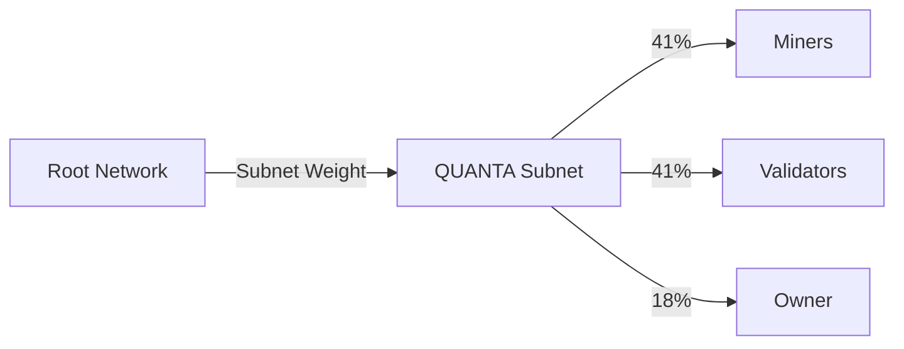

# Emission Schedule

QUANTA operates with two emission sources: TAO from Bittensor and native α-tokens. This page details both schedules.

## TAO Emissions

### How TAO Flows to QUANTA

TAO emissions come from Bittensor's root network:



### Dynamic Allocation

QUANTA's TAO allocation depends on:

| Factor | Impact |
|--------|--------|
| Validator Stake | Higher stake → more emissions |
| Root Network Votes | Positive votes → more emissions |
| Subnet Performance | Quality metrics → more emissions |
| Total Network Emissions | Base rate varies |

### Estimated TAO Schedule

| Period | Daily TAO | Monthly TAO | Annual TAO |
|--------|-----------|-------------|------------|
| Month 1-3 | ~50 TAO | ~1,500 TAO | — |
| Month 4-6 | ~100 TAO | ~3,000 TAO | — |
| Month 7-12 | ~150 TAO | ~4,500 TAO | — |
| Year 2+ | ~200 TAO | ~6,000 TAO | ~73,000 TAO |

<Note>
TAO emissions are dynamic and depend on Bittensor network conditions. These are estimates.
</Note>

### TAO Distribution Example

**Daily scenario:** 100 TAO emission

```
Total:     100 TAO
Miners:     41 TAO (41%)
Validators: 41 TAO (41%)
Owner:      18 TAO (18%)
```

**Per-participant:**
```
Assuming 500 miners, 64 validators:

Top miner (10% of pool): 4.1 TAO
Average miner: ~0.08 TAO
Validator (1.5% of stake): ~0.6 TAO
```

## α-Token Emissions

### Overview

| Category | Allocation | Schedule |
|----------|------------|----------|
| Miner Emissions | 40M α | 4 years |
| Validator Rewards | 25M α | Ongoing |
| Team & Advisors | 20M α | 2 years |
| Ecosystem Fund | 10M α | 3 years |
| Initial Liquidity | 5M α | Immediate |

### Miner Emission Curve

Emissions follow exponential decay with 4-year halving:

```python
def miner_emission(day, total=40_000_000):
    """
    Exponential decay emission schedule
    Half of remaining emitted every ~730 days (2 years)
    """
    decay_rate = 0.5 ** (1 / 730)
    daily = total * (1 - decay_rate) * (decay_rate ** day)
    return daily
```

### Year-by-Year Breakdown

<Tabs>
  <Tab title="Year 1">
    **Total Emissions:** ~16,000,000 α (40%)

    | Quarter | Emissions | Daily Average |
    |---------|-----------|---------------|
    | Q1 | 5,500,000 α | ~61,000 α |
    | Q2 | 4,500,000 α | ~50,000 α |
    | Q3 | 3,500,000 α | ~39,000 α |
    | Q4 | 2,500,000 α | ~28,000 α |
  </Tab>
  <Tab title="Year 2">
    **Total Emissions:** ~12,000,000 α (30%)

    | Quarter | Emissions | Daily Average |
    |---------|-----------|---------------|
    | Q1 | 3,500,000 α | ~39,000 α |
    | Q2 | 3,000,000 α | ~33,000 α |
    | Q3 | 2,800,000 α | ~31,000 α |
    | Q4 | 2,700,000 α | ~30,000 α |
  </Tab>
  <Tab title="Year 3">
    **Total Emissions:** ~8,000,000 α (20%)

    | Quarter | Emissions | Daily Average |
    |---------|-----------|---------------|
    | Q1 | 2,200,000 α | ~24,000 α |
    | Q2 | 2,000,000 α | ~22,000 α |
    | Q3 | 1,900,000 α | ~21,000 α |
    | Q4 | 1,900,000 α | ~21,000 α |
  </Tab>
  <Tab title="Year 4">
    **Total Emissions:** ~4,000,000 α (10%)

    | Quarter | Emissions | Daily Average |
    |---------|-----------|---------------|
    | Q1 | 1,100,000 α | ~12,000 α |
    | Q2 | 1,000,000 α | ~11,000 α |
    | Q3 | 950,000 α | ~10,500 α |
    | Q4 | 950,000 α | ~10,500 α |
  </Tab>
</Tabs>

### Visual Emission Curve

```
Daily Emissions (α)
│
60k │████
    │████████
50k │████████████
    │████████████████
40k │████████████████████
    │████████████████████████
30k │████████████████████████████
    │████████████████████████████████
20k │████████████████████████████████████
    │████████████████████████████████████████
10k │████████████████████████████████████████████
    │████████████████████████████████████████████████
────┴────────────────────────────────────────────────────
    Y1-Q1  Y1-Q3  Y2-Q1  Y2-Q3  Y3-Q1  Y3-Q3  Y4-Q1  Y4-Q3
```

## Circulating Supply

### Projection

| Month | New Emissions | Cumulative | % of Total |
|-------|---------------|------------|------------|
| 0 | 5M (liquidity) | 5M | 5% |
| 3 | 5.5M | 10.5M | 10.5% |
| 6 | 5M + 1M (team) | 16.5M | 16.5% |
| 12 | 8M + 4M | 28.5M | 28.5% |
| 24 | 12M + 10M | 50.5M | 50.5% |
| 36 | 8M + 6M | 64.5M | 64.5% |
| 48 | 4M + 0 | 68.5M | 68.5% |

<Warning>
This projection excludes burns. Actual circulating supply will be lower due to the burn mechanism.
</Warning>

### Supply with Burns

Accounting for ~0.8% annual burn from forfeited antes:

```python
# Year 1 end
emitted = 28_500_000
burned = 28_500_000 × 0.008 = 228_000
net_supply = 28_272_000

# Year 2 end
emitted = 50_500_000
burned_cumulative = ~800_000
net_supply = 49_700_000
```

## Validator Rewards

### Source

Validator α-token rewards come from:

1. **Protocol Fees** — 8% network rake
2. **Staking Rewards** — Dedicated allocation
3. **Performance Bonuses** — Consensus alignment

### Distribution

```python
def validator_reward(validator, epoch):
    # Base reward from fee pool
    fee_pool = epoch.network_rake × 0.50  # 50% to validators
    stake_weight = validator.stake / total_validator_stake
    base = fee_pool × stake_weight

    # Alignment bonus
    alignment = calculate_alignment(validator.scores, consensus)
    bonus = base × alignment × 0.20  # Up to 20% bonus

    return base + bonus
```

### Target APY

| Stake Tier | Target APY |
|------------|------------|
| 10,000 α | 12% |
| 50,000 α | 15% |
| 100,000+ α | 18% |

## Halving Events

### Schedule

| Event | Date | Effect |
|-------|------|--------|
| Launch | Month 0 | Full emission rate |
| First Halving | Month 24 | 50% emission rate |
| Second Halving | Month 48 | 25% emission rate |
| Third Halving | Month 72 | 12.5% emission rate |

### Post-Schedule

After Year 4, remaining emissions (~68M of 100M emitted):

- Minimal new miner emissions
- Validator rewards from fees only
- Ecosystem fund depleted
- Self-sustaining through network fees

## Emission Controls

### Governance Adjustable

The following can be changed via governance:

| Parameter | Range | Governance |
|-----------|-------|------------|
| Emission rate multiplier | 0.5× - 2× | DAO vote |
| Tier thresholds | ±20% | DAO vote |
| Burn rate | 25% - 75% | DAO vote |

### Emergency Mechanisms

| Situation | Response |
|-----------|----------|
| Critical bug | Pause emissions (multisig) |
| Market manipulation | Temporary caps |
| Network attack | Emergency governance |

## Emission Dashboard

Track live emissions at:

```
https://qsub.net/emissions
```

| Metric | Description |
|--------|-------------|
| Daily Emission | Today's α emitted |
| Cumulative | Total α ever emitted |
| Burn Rate | Daily α burned |
| Net Supply | Emitted minus burned |
| Projected | Future emission estimates |

## Next Steps

<CardGroup cols={2}>
  <Card title="Quickstart" icon="rocket" href="/guides/quickstart">
    Start earning emissions
  </Card>
  <Card title="Tokenomics Overview" icon="coins" href="/tokenomics/overview">
    Full economic model
  </Card>
</CardGroup>
