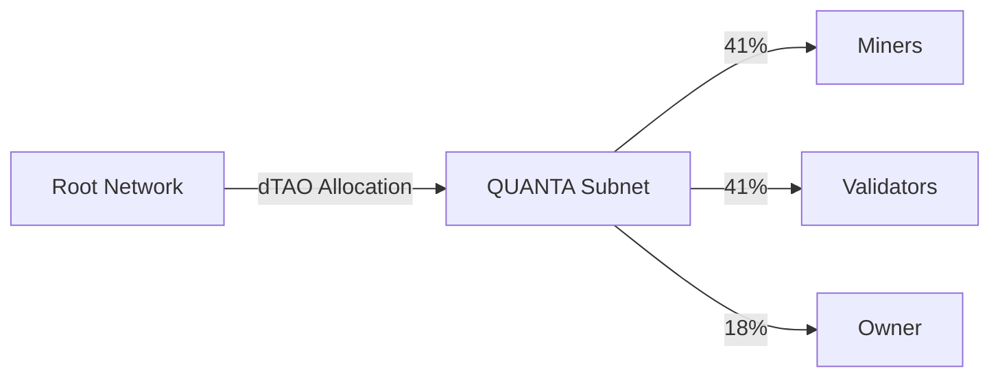

# Emission Schedule

QUANTA operates with two emission sources: TAO from Bittensor's network emissions and native α-tokens from the subnet's own emission schedule. Both follow Bittensor's dTAO (Dynamic TAO) model.

## Understanding dTAO Emissions

<Note>
Bittensor's dTAO system introduced subnet-specific α-tokens in February 2025. Each subnet emits its own α-token following the same halving schedule as TAO, with a 21 million maximum supply cap.
</Note>

### Key Principles

| Principle | Description |
|-----------|-------------|
| Protocol-Controlled | Emission rates set by Bittensor, not subnet owners |
| 21M Maximum | Hard cap mirrors TAO's supply limit |
| Halving Schedule | Emissions halve after ~10.5M α minted |
| Market-Priced | α-token value determined by staking demand |

## TAO Emissions

### How TAO Flows to QUANTA

TAO emissions come from Bittensor's root network based on subnet demand:



### Dynamic Allocation

QUANTA's TAO allocation depends on:

| Factor | Impact |
|--------|--------|
| α-Token Staking | More TAO staked in subnet → more emissions |
| Market Demand | Higher α-token price → more root weight |
| Subnet Performance | Quality signals → sustained demand |

### Estimated TAO Schedule

| Period | Daily TAO | Monthly TAO | Notes |
|--------|-----------|-------------|-------|
| Early Phase | ~10-50 TAO | ~300-1,500 TAO | Bootstrap period |
| Growth Phase | ~50-150 TAO | ~1,500-4,500 TAO | Gaining traction |
| Mature Phase | ~100-300 TAO | ~3,000-9,000 TAO | Established subnet |

<Note>
TAO emissions are entirely dynamic and depend on market-driven staking demand. These are illustrative estimates only.
</Note>

## α-Token Emissions

### Protocol-Controlled Supply

Unlike traditional token launches, QUANTA's α-token supply is controlled by Bittensor's protocol:

| Property | Value |
|----------|-------|
| Maximum Supply | 21,000,000 α |
| Initial Emission | ~2 α/block |
| First Halving | ~10,500,000 α minted |
| Block Time | ~12 seconds |

### Emission Distribution

All α-token emissions are distributed in real-time:

| Recipient | Share | Role |
|-----------|-------|------|
| Signal Generators (Miners) | 41% | Performance-based rewards |
| Validators | 41% | Infrastructure and consensus |
| Subnet Owner | 18% | Protocol development |

### Daily Emission Estimates

```python
# At launch (~2 α/block, ~7200 blocks/day)
daily_emission = 2 × 7200 = ~14,400 α/day

# Distribution:
miners_daily = 14,400 × 0.41 = ~5,900 α
validators_daily = 14,400 × 0.41 = ~5,900 α
owner_daily = 14,400 × 0.18 = ~2,600 α
```

### Emission Phases

<Tabs>
  <Tab title="Phase 1: Launch">
    **Emission Rate:** ~2 α/block
    **Supply Range:** 0 → ~10.5M α

    | Metric | Value |
    |--------|-------|
    | Daily Emission | ~14,400 α |
    | Monthly Emission | ~430,000 α |
    | Time to Halving | ~2-3 years |

    High emission rate attracts early participants and bootstraps network.
  </Tab>
  <Tab title="Phase 2: Post-Halving 1">
    **Emission Rate:** ~1 α/block
    **Supply Range:** 10.5M → ~15.75M α

    | Metric | Value |
    |--------|-------|
    | Daily Emission | ~7,200 α |
    | Monthly Emission | ~215,000 α |
    | Time to Next Halving | ~2-3 years |

    Reduced emissions as network matures.
  </Tab>
  <Tab title="Phase 3: Post-Halving 2">
    **Emission Rate:** ~0.5 α/block
    **Supply Range:** 15.75M → ~18.4M α

    | Metric | Value |
    |--------|-------|
    | Daily Emission | ~3,600 α |
    | Monthly Emission | ~108,000 α |

    Low emissions; network relies more on fee revenue.
  </Tab>
  <Tab title="Phase 4: Asymptotic">
    **Emission Rate:** Decreasing
    **Supply Range:** Approaching 21M α

    Minimal new emissions. Network fully self-sustaining through:
    - Competition pot fees
    - API subscriptions
    - Licensing revenue
  </Tab>
</Tabs>

### Visual Emission Curve

```
Daily Emissions (α)
│
15k │████████████████████████████████████████████████
    │████████████████████████████████████████████████
12k │████████████████████████████████████████
    │████████████████████████████████████████
 9k │████████████████████████████████
    │████████████████████████████████
 6k │████████████████████████               ← Halving 1
    │████████████████████████
 3k │████████████████                       ← Halving 2
    │████████████████
   0│──────────────────────────────────────────────────
    Y1     Y2     Y3     Y4     Y5     Y6     Y7     Y8
```

## Circulating Supply Projection

### Growth Model

| Year | Cumulative Supply | % of Maximum |
|------|-------------------|--------------|
| 1 | ~3-5M α | ~15-25% |
| 2 | ~6-9M α | ~30-45% |
| 3 | ~9-12M α | ~45-55% |
| 4 | ~11-14M α | ~55-65% |
| 5+ | Approaching halving, slower growth | 65%+ |

<Warning>
This projection excludes burns. Actual circulating supply will be lower due to the burn mechanism (50% of forfeited antes).
</Warning>

### Supply with Burns

```python
# Example: Year 2 with active network
emitted_cumulative = 8_000_000  # α
annual_burn_rate = 0.015  # ~1.5% of circulating burned

burned = emitted_cumulative × annual_burn_rate
# = ~120,000 α burned

net_supply = emitted_cumulative - burned
# = ~7,880,000 α actual circulation
```

## Validator Rewards

### Sources

Validators earn from multiple streams:

1. **α-Token Emissions** — 41% of subnet emissions
2. **TAO Emissions** — 41% of TAO flowing to subnet
3. **Protocol Fees** — Share of network rake

### Target APY

| Factor | Impact on APY |
|--------|---------------|
| α-Token Stake | Higher stake → more emissions |
| Consensus Alignment | Better alignment → bonus rewards |
| Uptime | 99%+ required for full rewards |

<Info>
Validator APY varies based on total validator stake and emission rates. Early validators with significant stake may see higher returns during the bootstrap phase.
</Info>

## Halving Schedule

### Bittensor Protocol Halvings

| Event | Trigger | Effect |
|-------|---------|--------|
| Halving 1 | ~10.5M α minted | 50% emission rate |
| Halving 2 | ~15.75M α minted | 25% emission rate |
| Halving 3 | ~18.4M α minted | 12.5% emission rate |
| Asymptotic | Approaching 21M | Minimal emissions |

### Impact on Participants

| Phase | Miner Strategy | Validator Strategy |
|-------|----------------|-------------------|
| Pre-Halving | High emissions, compete for share | Stake early for higher returns |
| Post-Halving 1 | Fewer rewards, quality matters more | Established validators dominate |
| Post-Halving 2+ | Fee revenue becomes primary | Long-term sustainable returns |

## Emission Controls

### Governance Parameters

The following can be adjusted via governance (affects distribution, not supply cap):

| Parameter | Range | Governance |
|-----------|-------|------------|
| Distribution split | 30/30/40 to 50/50/0 | DAO vote |
| Tier thresholds | ±20% | DAO vote |
| Burn rate | 25% - 75% | DAO vote |

<Warning>
The 21M supply cap and halving schedule are **protocol-level constraints** that cannot be changed by subnet governance. Only the Bittensor network itself can modify these parameters.
</Warning>

## Emission Dashboard

Track live emissions at:

```
https://qsub.net/emissions
```

| Metric | Description |
|--------|-------------|
| Current Rate | α/block being emitted |
| Circulating | Total α in circulation |
| Burned | Cumulative α burned |
| Net Supply | Circulating minus burned |
| Next Halving | Blocks/time until halving |

## Next Steps

<CardGroup cols={2}>
  <Card title="Quickstart" icon="rocket" href="/guides/quickstart">
    Start earning emissions
  </Card>
  <Card title="α-Token Details" icon="circle-dollar" href="/tokenomics/alpha-token">
    Full token specification
  </Card>
</CardGroup>
