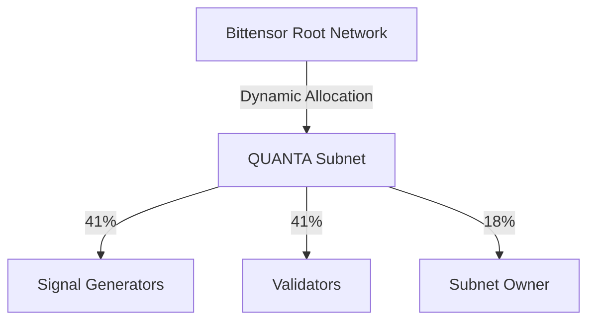

# Tokenomics Overview

QUANTA operates with a dual-token model that combines Bittensor's native TAO with QUANTA's native α-token to create aligned incentives across all participants.

## Two Tokens, One Network

<CardGroup cols={2}>
  <Card title="TAO (Bittensor)" icon="coins">
    Native Bittensor token providing sustainable emissions and network security
  </Card>
  <Card title="α-Token (QUANTA)" icon="circle-dollar">
    Native QUANTA token for staking, governance, and competition participation
  </Card>
</CardGroup>

## TAO: The Foundation

### What TAO Provides

| Function | Benefit |
|----------|---------|
| Emissions | Sustainable rewards without external capital |
| Staking | Validator security and alignment |
| Network Effects | Connection to Bittensor ecosystem |
| Liquidity | Established markets and liquidity |

### TAO Flow in QUANTA



## α-Token: The Incentive Layer

### Core Functions

<AccordionGroup>
  <Accordion title="Staking" icon="lock">
    **Validators:** Must stake minimum 10,000 α to participate in consensus

    **Signals:** Proportional stake required based on position exposure

    ```
    Signal stake = Gross exposure × Base rate
    Validator stake = 10,000 α minimum
    ```
  </Accordion>

  <Accordion title="Competition Ante" icon="trophy">
    Signal generators stake α-tokens to participate in the competition pot:

    - Winners earn redistributed stakes from losers
    - Bottom performers forfeit their ante
    - Creates real "skin in the game"
  </Accordion>

  <Accordion title="Governance" icon="gavel">
    α-token holders vote on protocol parameters:

    - Scoring metric weights
    - Evaluation window durations
    - Emission schedules
    - Universe composition
  </Accordion>

  <Accordion title="Fee Discounts" icon="percent">
    Stake α-tokens for reduced fees:

    - API access tiers
    - Premium analytics
    - Priority processing
  </Accordion>
</AccordionGroup>

## Token Supply

### α-Token Distribution

| Allocation | Percentage | Amount | Vesting |
|------------|------------|--------|---------|
| Miner Emissions | 40% | 40,000,000 α | 4-year emission schedule |
| Validator Rewards | 25% | 25,000,000 α | Performance-based |
| Team & Advisors | 20% | 20,000,000 α | 2-year cliff + vesting |
| Ecosystem Fund | 10% | 10,000,000 α | Grants and partnerships |
| Initial Liquidity | 5% | 5,000,000 α | DEX launch |
| **Total Supply** | **100%** | **100,000,000 α** | — |

### Supply Schedule

```
Year 0: 15M α circulating (15%)
Year 1: 35M α circulating (35%)
Year 2: 55M α circulating (55%)
Year 3: 75M α circulating (75%)
Year 4: 90M α circulating (90%)
Year 5+: Approaching 100M α
```

## Value Accrual

### How α-Token Captures Value

<Steps>
  <Step title="Staking Demand">
    Validators must stake α to earn TAO emissions. More validators = more demand.
  </Step>
  <Step title="Performance Correlation">
    Protocol revenue used for buybacks when network hits performance targets.
  </Step>
  <Step title="Burn Mechanism">
    50% of forfeited antes are burned, reducing supply over time.
  </Step>
  <Step title="Governance Premium">
    Control over multi-million dollar parameter decisions creates governance value.
  </Step>
</Steps>

### Deflationary Mechanics

```python
# Each epoch
forfeited_antes = sum(antes from bottom 30% performers)
burned = forfeited_antes * 0.50  # Permanent supply reduction

# Over time
cumulative_burn = sum(burned per epoch)
effective_supply = total_supply - cumulative_burn
```

<Info>
With 30% of signals forfeiting antes each epoch and 50% burn rate, significant supply reduction occurs over time.
</Info>

## Key Metrics

### Target Metrics (Year 1)

| Metric | Target |
|--------|--------|
| α-Token Market Cap | $50M+ |
| Daily Trading Volume | $2M+ |
| Total Value Staked | $10M+ |
| Validator APY | 12-18% |
| TAO Emissions/Day | 100+ TAO |

### Network Health Indicators

| Indicator | Healthy Range |
|-----------|---------------|
| Stake ratio (staked/circulating) | >60% |
| Validator participation | >80% |
| Signal diversity | >500 unique signals |
| Correlation (pairwise) | Less than 0.3 average |

## Token Utility Summary

| Use Case | Requirement | Benefit |
|----------|-------------|---------|
| Submit signal | Proportional stake | Participate in competition |
| Run validator | 10,000+ α | Earn TAO + validation rewards |
| Vote on governance | Any α holdings | Protocol control |
| API premium tier | 1,000+ α staked | Reduced fees, priority |
| Liquidity provision | LP tokens | LP rewards + fees |

## Economic Flywheel

The dual-token model creates a self-reinforcing cycle:

```
Better Signals → Higher Network Returns → More TAO Emissions
                                              ↓
                                         More Validators
                                              ↓
                                      More α Staking Demand
                                              ↓
                                        Higher α Value
                                              ↓
                                    More Signal Generators
                                              ↓
                                       Better Signals
```

## Next Steps

<CardGroup cols={2}>
  <Card title="Dual Revenue Model" icon="layer-group" href="/tokenomics/dual-revenue">
    Deep dive into pot + emissions
  </Card>
  <Card title="α-Token Details" icon="circle-dollar" href="/tokenomics/alpha-token">
    Complete α-token specification
  </Card>
</CardGroup>
